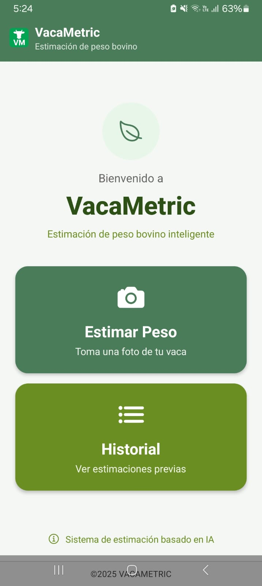
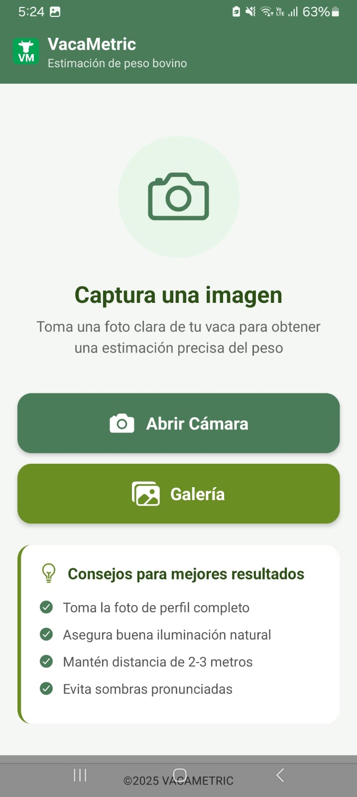
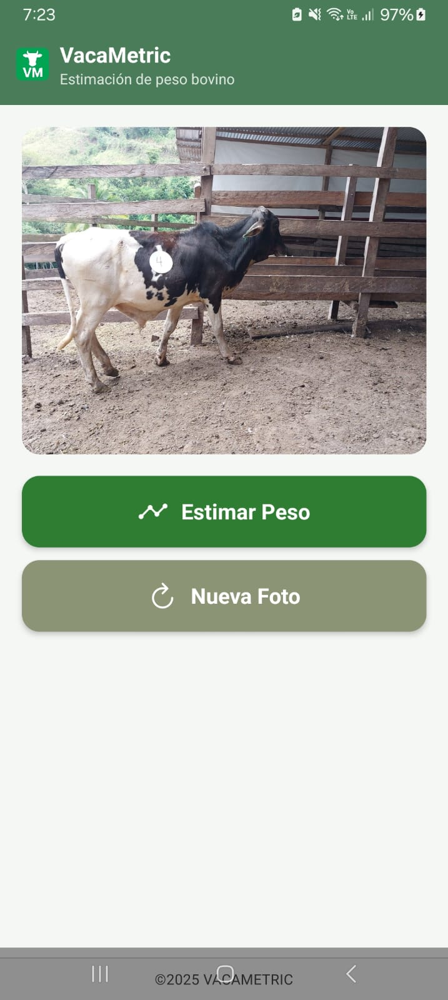
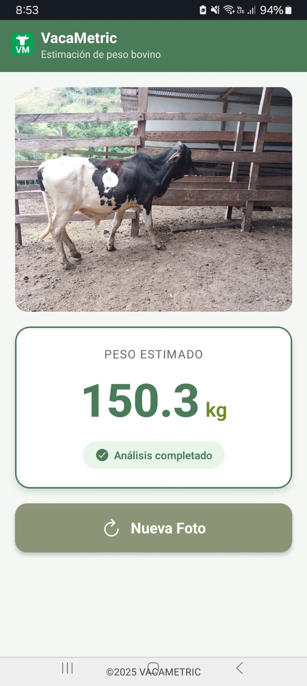

# VacaMetric - Frontend (Aplicación Móvil)

## 📱 Descripción
Aplicación móvil desarrollada en React Native con Expo para la estimación del peso de ganado bovino mediante análisis de imágenes usando inteligencia artificial.

## 🚀 Repositorios del Proyecto
- **Frontend (App Móvil)**: https://github.com/MiguelValles80/VacaMetric-Project-Front
- **Backend (Modelos IA)**: https://github.com/MiguelValles80/VacaMetric-Project-Back

## 📋 Requisitos Previos

### Software Necesario
- Node.js (v16 o superior)
- npm o yarn
- Expo CLI
- Android Studio (para emulador Android) o Xcode (para iOS)
- Expo Go app en dispositivo móvil (opcional)

### Backend
Asegúrate de tener el backend corriendo en tu red local. Por defecto, la app se conecta a:
```
http://192.168.100.7:8000
```

## 🔧 Instalación

### 1. Clonar el Repositorio
```bash
git clone https://github.com/MiguelValles80/VacaMetric-Project-Front.git
cd VacaMetric-Project-Front
```

### 2. Instalar Dependencias
```bash
npm install
```

### 3. Configurar la URL del Backend
Edita el archivo `src/services/api.ts` y cambia la IP por la de tu servidor backend:
```typescript
const api = axios.create({
  baseURL: 'http://TU_IP_BACKEND:8000',
  timeout: 60000,
});
```

## ▶️ Ejecución

### Modo Desarrollo
```bash
# Iniciar Expo
npx expo start

# Escanea el código QR con Expo Go (Android/iOS)
# O presiona 'a' para Android Emulator
# O presiona 'i' para iOS Simulator
```

### Limpiar Caché (si hay problemas)
```bash
npx expo start -c
```

## 📦 Compilación

### Build para Android (APK)
```bash
# Instalar EAS CLI
npm install -g eas-cli

# Login en Expo
eas login

# Configurar build
eas build:configure

# Crear APK
eas build -p android --profile preview
```

### Build para iOS
```bash
eas build -p ios --profile preview
```

## 📁 Estructura del Proyecto
```
Front/
├── src/
│   ├── components/          # Componentes reutilizables
│   │   ├── CustomHeader.tsx
│   │   └── Footer.tsx
│   ├── navigation/          # Navegación de la app
│   │   └── AppNavigator.tsx
│   ├── screens/            # Pantallas principales
│   │   ├── TomarFotoVacaScreen.tsx
│   │   ├── MenuRegistroScreen.tsx
│   │   └── HistorialScreen.tsx
│   └── services/           # Servicios API
│       └── api.ts
├── assets/                 # Recursos estáticos
├── App.tsx                # Componente principal
└── package.json
```

## 🎯 Funcionalidades

1. **Captura de Imagen**: Tomar foto de la vaca con la cámara del dispositivo
2. **Estimación de Peso**: Envío de imagen al backend para análisis con IA
3. **Historial**: Almacenamiento local de estimaciones realizadas
4. **Interfaz Intuitiva**: Diseño simple y fácil de usar

## 🛠️ Tecnologías Utilizadas

- **React Native**: Framework para desarrollo móvil
- **Expo**: Plataforma de desarrollo
- **TypeScript**: Lenguaje de programación
- **Axios**: Cliente HTTP para API REST
- **AsyncStorage**: Almacenamiento local
- **React Navigation**: Navegación entre pantallas
- **Expo Camera**: Acceso a cámara del dispositivo
- **Expo Image Picker**: Selección de imágenes

## 📱 Capturas de Pantalla

🎥 **Demo del sistema**  
[Ver video en YouTube](https://youtube.com/shorts/A9nyYvHjHFc?feature=share) 

### Pantalla de Inicio


### Pantalla de Captura


### Confirmacion de Captura


### Resultados de Estimación


## 🐛 Solución de Problemas

### Error de Conexión con Backend
- Verifica que el backend esté corriendo
- Confirma que estás en la misma red WiFi
- Revisa que la IP en `api.ts` sea correcta
- Desactiva firewall si es necesario

### Error al Instalar Dependencias
```bash
rm -rf node_modules
npm cache clean --force
npm install
```

## 👥 Autor
Miguel Angel Valles Coral

## 📄 Licencia
Este proyecto es parte de un trabajo académico.

## 📞 Soporte
Para más información, consulta el [Manual de Usuario](MANUAL_USUARIO.md) y el [Manual Técnico](MANUAL_TECNICO.md).
